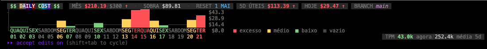

# claude-code-daily-cost

Skills para acompanhar o gasto do [Claude Code](https://claude.com/claude-code) no terminal, com **métricas inline direto na statusline** (hoje, semana, mês, sobra, reset, branch) e comando dedicado para ver o histórico em tabela.

## Principais comandos

### `/daily-cost-enable-metrics-inline`

Liga as métricas da statusline do Claude Code editando `~/.claude/skills/daily-cost/config.json`. A partir daí, o custo aparece **em tempo real** enquanto você trabalha — sem precisar rodar nenhum comando.

```
/daily-cost-enable-metrics-inline              # liga tudo
/daily-cost-enable-metrics-inline today month  # só hoje e mês
/daily-cost-enable-metrics-inline hoje sobra   # aceita PT também
```

Segmentos disponíveis:

| Segmento | O que mostra |
|----------|--------------|
| `today` | `hoje $X` |
| `week` | `Nd úteis $X` |
| `month` | `mês $X/$LIMIT` |
| `remaining` | `sobra $X` dentro dos parênteses do mês |
| `reset` | data de reset dentro dos parênteses do mês |
| `branch` | `branch <nome> Xk tok · $X` (branch git do cwd + custo) |

### `/daily-cost-disable-metrics-inline`

Desliga segmentos da statusline. Mesma sintaxe — sem argumentos desliga todos, ou passe os nomes pra desligar seletivamente.

```
/daily-cost-disable-metrics-inline             # desliga tudo
/daily-cost-disable-metrics-inline branch      # só esconde o segmento da branch
```

### Preview

Exemplo da statusline com todos os segmentos ligados (mês, sobra, reset, dias úteis, hoje, branch + gráfico mensal e TPM):



### `/daily-cost` (histórico em tabela)

Mostra gasto dos últimos N dias úteis + mês vs. limite, com gráfico ASCII.

```
/daily-cost        # últimos 5 dias úteis
/daily-cost 10     # últimos 10 dias úteis
```

Exemplo de saída:

```
  Claude Code — últimos 5 dias úteis  (custo em USD, tokens totais)
  ────────────────────────────────────────────────────────────────
  2026-04-15 Qua  $ 97.94  ████████████████████████████   36.56M tok  (733 msg)
  2026-04-16 Qui  $ 38.22  ███████████░░░░░░░░░░░░░░░░░   30.68M tok  (587 msg)
  2026-04-17 Sex  $ 12.66  ████░░░░░░░░░░░░░░░░░░░░░░░░   27.31M tok  (483 msg)
  2026-04-20 Seg  $ 41.10  ████████████░░░░░░░░░░░░░░░░   20.34M tok  (400 msg)
  2026-04-21 Ter  $ 65.76  ███████████████████░░░░░░░░░   19.60M tok  (316 msg)
  ────────────────────────────────────────────────────────────────
  TOTAL                     $255.68                                134.49M tok
```

## Instalação

```bash
git clone git@github.com:dereckleme/claude-code-daily-cost.git
cp -r claude-code-daily-cost/daily-cost ~/.claude/skills/
cp -r claude-code-daily-cost/daily-cost-enable-metrics-inline ~/.claude/skills/
cp -r claude-code-daily-cost/daily-cost-disable-metrics-inline ~/.claude/skills/
```

Pra statusline consumir o script inline, aponte `statusLine` no `~/.claude/settings.json`:

```json
{
  "statusLine": {
    "type": "command",
    "command": "python3 ~/.claude/skills/daily-cost/statusline.py"
  }
}
```

Reinicie o Claude Code. Depois rode `/daily-cost-enable-metrics-inline` e a statusline passa a mostrar o custo.

## Configuração

`~/.claude/skills/daily-cost/config.json`:

```json
{
  "segments": {
    "today": true,
    "week": true,
    "month": true,
    "remaining": true,
    "reset": true,
    "branch": true,
    "tpm_chart": true
  },
  "monthly_limit": 300.00,
  "plan_coefficient": 0.4419,
  "business_days": 5
}
```

- `segments` — o que aparece na statusline (controlado pelas skills `enable`/`disable-metrics-inline`)
- `monthly_limit` — teto mensal em USD
- `plan_coefficient` — fator aplicado ao custo bruto (use `1.0` se você paga preço cheio da API)
- `business_days` — padrão quando `/daily-cost` é chamado sem argumento

## Skills incluídas

| Skill | Comando | O que faz |
|-------|---------|-----------|
| `daily-cost-enable-metrics-inline` | `/daily-cost-enable-metrics-inline` | **Liga** métricas na statusline |
| `daily-cost-disable-metrics-inline` | `/daily-cost-disable-metrics-inline` | **Desliga** métricas na statusline |
| `daily-cost` | `/daily-cost [dias]` | Tabela com histórico de gasto |

## Requisitos

- Python 3
- Claude Code instalado com transcripts em `~/.claude/projects/`
